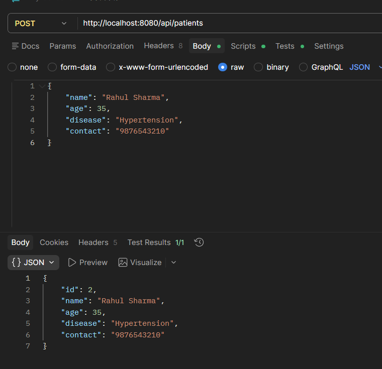
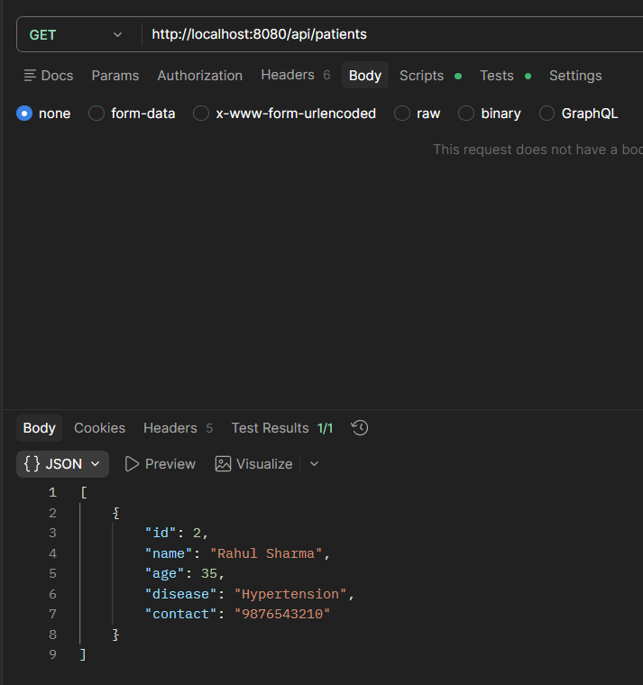
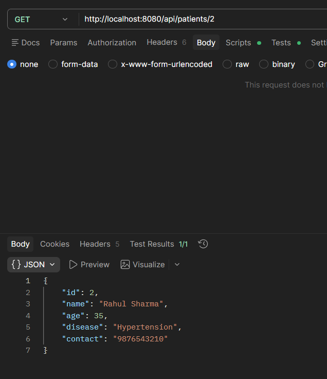
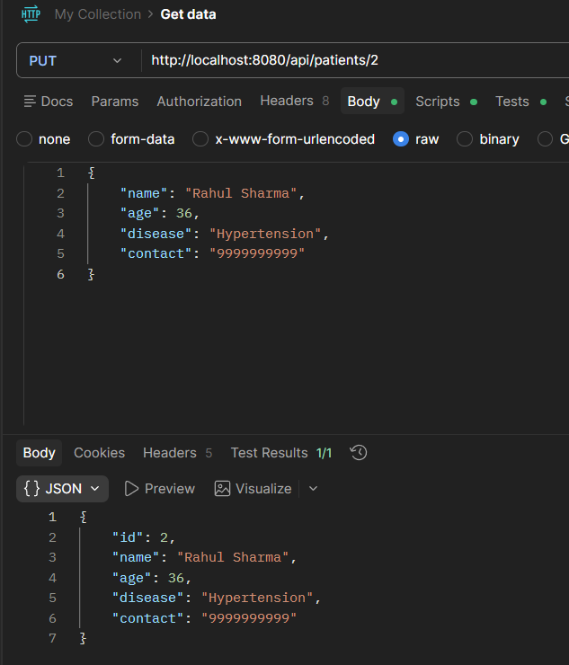
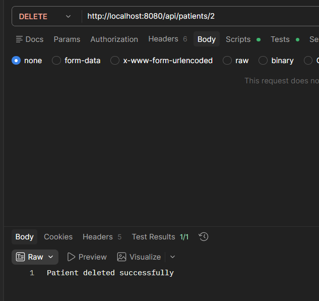

# Experiment 6: Patient Management CRUD API

## Overview
This project is a RESTful API built with Spring Boot to manage patient records. It implements full CRUD (Create, Read, Update, Delete) operations and utilizes an in-memory H2 database for lightweight data storage during runtime.

## Tech Stack
* **Framework:** Spring Boot 4.0.4
* **Language:** Java 17
* **Database:** H2 In-Memory Database
* **Dependencies:** Spring Web, Spring Data JPA, Lombok

## Setup and Execution
1. Clone or download the repository.
2. Open the `healthhub` project folder in your IDE.
3. Run the application from `PatientCrudApiApplication.java`.
4. The server will start on `http://localhost:8080`.

---

## API Endpoints & Testing

All endpoints are mapped to the base URL: `/api/patients`

### 1. Create a Patient (POST)
Creates a new patient record in the database. The ID is auto-generated.
* **URL:** `POST http://localhost:8080/api/patients`
* **Body (JSON):**
```json
{
    "name": "Rahul Sharma",
    "age": 35,
    "disease": "Hypertension",
    "contact": "9876543210"
}
```
#### Postman Result


### 2. Get All Patients (GET)
Retrieves a list of all patients currently stored in the system.
* **URL:** `GET http://localhost:8080/api/patients`
* **Body:** None

#### Postman Result


### 3. Get Patient by ID (GET)
Retrieves the details of a specific patient using their unique ID.
* **URL:** `GET http://localhost:8080/api/patients/1`
* **Body:** None

#### Postman Result


### 4. Update a Patient (PUT)
Updates the details of an existing patient. 
* **URL:** `PUT http://localhost:8080/api/patients/1`
* **Body (JSON):**
```json
{
    "name": "Rahul Sharma",
    "age": 36,
    "disease": "Hypertension",
    "contact": "9999999999"
}
```
#### Postman Result


### 5. Delete a Patient (DELETE)
Removes a patient record from the database.
* **URL:** `DELETE http://localhost:8080/api/patients/1`
* **Body:** None

#### Postman Result


---

## Database Access
This application uses an H2 database. To view the raw tables:
1. Ensure the Spring Boot application is running.
2. Navigate to `http://localhost:8080/h2-console` in your browser.
3. Use the following credentials:
   * **JDBC URL:** `jdbc:h2:mem:testdb`
   * **Username:** `sa`
   * **Password:** *(leave blank)*